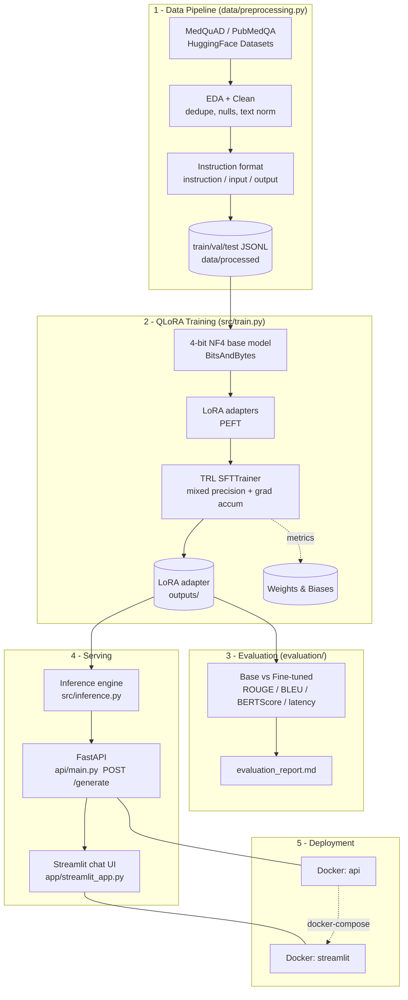

# 🩺 Domain-Specific LLM Fine-Tuning using QLoRA and PyTorch — Healthcare Assistant

> Fine-tune an open-source LLM with **QLoRA** to build a production-grade,
> domain-specific **medical question-answering assistant**, served via a
> **FastAPI** backend and a **Streamlit** chat UI, with experiment tracking
> (**Weights & Biases**), a base-vs-fine-tuned **evaluation** suite, unit tests,
> and full **Docker** deployment.

[](https://www.python.org/)
[](https://pytorch.org/)
[](https://huggingface.co/docs/transformers)
[](LICENSE)

---

## 1. Problem Statement

General-purpose instruction-tuned LLMs (e.g. Phi-3, Llama 3.2) give plausible but
often **vague, unstructured, or hedging** answers to medical questions. Hospitals,
tele-health platforms, and patient-facing products need an assistant that responds
in the **vocabulary, structure, and tone of clinical reference material** while
remaining cheap to run.

Full fine-tuning of even a 3B model needs **tens of GB of VRAM** — out of reach
for most teams. **QLoRA** (Quantized Low-Rank Adaptation) makes it possible to
specialize such a model on a **single consumer GPU (≈8–12 GB VRAM)** by:

1. Freezing the base model in **4-bit precision** (BitsAndBytes NF4).
2. Training only tiny **low-rank adapters** (<1% of parameters).

This repository delivers the **entire lifecycle** — data → training → tracking →
evaluation → serving → UI → deployment — as an industry-style codebase, not a
notebook.

> ⚠️ **Medical disclaimer:** This project is an engineering demonstration. Model
> outputs are **not medical advice**. A safety disclaimer is appended to every
> served answer.

---

## 2. Architecture



**Why this shape?** The model lives behind **one** HTTP service (`api`), and the
UI is a **thin client**. Training/eval/serving all import the *same*
`src/model.py` + `src/utils.py` prompt-building code, eliminating the classic
"works in training, broken in production" prompt-format drift.

---

## 3. Project Structure

```
.
├── data/
│   ├── raw/                  # downloaded + raw snapshot (git-ignored)
│   ├── processed/            # train/val/test JSONL (git-ignored)
│   └── preprocessing.py      # load → EDA → clean → format → split → persist
├── src/
│   ├── config.py             # all config (env Settings + frozen dataclasses)
│   ├── utils.py              # logging, seeding, device, prompt formatting
│   ├── model.py              # 4-bit quant + LoRA + tokenizer construction
│   ├── train.py              # QLoRA SFT training (TRL SFTTrainer)
│   └── inference.py          # HealthcareAssistant: load adapter + generate
├── experiments/
│   └── tracking.py           # Weights & Biases integration
├── evaluation/
│   ├── metrics.py            # ROUGE / BLEU / BERTScore / latency
│   └── evaluate.py           # base-vs-finetuned pipeline → report
├── api/
│   ├── main.py               # FastAPI app (/health /model-info /generate)
│   └── schemas.py            # Pydantic request/response models
├── app/
│   └── streamlit_app.py      # chat UI (history, latency, model info)
├── tests/                    # pytest unit tests (29 tests)
├── Dockerfile                # FastAPI backend image
├── Dockerfile.streamlit      # Streamlit frontend image
├── docker-compose.yaml       # orchestrates api + streamlit
├── Makefile                  # make data / train / evaluate / api / ui / test
├── requirements.txt          # pinned runtime deps
├── requirements-dev.txt      # test/lint/type deps
├── pyproject.toml            # ruff + mypy + pytest config
├── .env.example              # configuration template
└── evaluation_report.md      # generated comparison report
```

---

## 4. Dataset

**Primary:** [MedQuAD](https://github.com/abachaa/MedQuAD) — Medical Question
Answering Dataset, ~16k QA pairs curated from 12 trusted NIH/U.S. National Library
of Medicine websites, covering diseases, symptoms, treatments, and drugs.

**Fallback:** [PubMedQA](https://pubmedqa.github.io/) (`pqa_labeled`) — biomedical
QA derived from PubMed abstracts. The pipeline automatically falls back to this if
the MedQuAD mirror is unavailable (`--dataset pubmedqa`).

The pipeline (`data/preprocessing.py`) performs:

| Stage | What happens | Why |
| --- | --- | --- |
| **Load** | Download via 🤗 `datasets`, normalize to `(question, answer)` | Decouple downstream code from source schema |
| **EDA** | Row counts, length distributions, duplicate/null stats, plots | Understand data before training |
| **Clean** | Unescape + strip HTML, collapse whitespace/newlines | Web-scraped medical text is noisy |
| **Dedupe** | Drop exact + question-level duplicates | Prevent memorization / leakage |
| **Filter** | Length thresholds, drop echo answers | Remove low-quality pairs |
| **Format** | Convert to instruction-tuning schema | Required by SFT |
| **Split** | Reproducible 80/10/10 train/val/test (seed=42) | Honest evaluation |

**Instruction-tuning schema:**

```json
{
  "instruction": "You are a knowledgeable medical assistant. Answer the patient's health question accurately, clearly, and safely...",
  "input": "What are symptoms of diabetes?",
  "output": "Common symptoms include increased thirst, frequent urination, fatigue, and blurred vision..."
}
```

Run it:

```bash
make data                              # full dataset
python -m data.preprocessing --max-samples 5000   # quick subset
python -m data.preprocessing --dataset pubmedqa   # use fallback
```

---

## 5. QLoRA Explained

**QLoRA = 4-bit Quantization + LoRA.** It is the key technique enabling
single-GPU fine-tuning of multi-billion-parameter models.

1. **4-bit NF4 quantization (BitsAndBytes).** The frozen base model's weights are
   stored in **4-bit NormalFloat (NF4)** — a data type that is information-
   theoretically optimal for the (roughly normal) distribution of neural network
   weights. **Double quantization** further compresses the quantization constants.
   This shrinks a ~3B model from ~12–14 GB (fp16) to **~2–3 GB**.

2. **LoRA adapters (PEFT).** Instead of updating the huge weight matrices `W`, LoRA
   freezes them and learns a low-rank update `ΔW = B·A` where `A ∈ R^{r×d}`,
   `B ∈ R^{d×r}` and `r ≪ d`. Only `A` and `B` are trained — **<1% of params** —
   injected into the attention/MLP projections.

3. **Why both?** Quantization saves *memory for the frozen base*; LoRA saves
   *memory + compute for the gradients/optimizer*. Computation flows through the
   4-bit base (dequantized to bf16 on the fly) plus the small bf16 adapters, with
   a **paged 8-bit optimizer** to avoid OOM spikes.

```
output = (dequantize_nf4(W_frozen) + scaling · B · A) · x
                      ▲ 4-bit, frozen        ▲ trainable LoRA (bf16)
```

**Result:** ~99% of full fine-tuning quality at a fraction of the memory.

---

## 6. Model & Training Configuration

**Base model:** `microsoft/Phi-3-mini-4k-instruct` (default, open, no gating) or
`meta-llama/Llama-3.2-3B-Instruct` (set `BASE_MODEL` in `.env`; requires HF
license acceptance + `HF_TOKEN`).

All hyper-parameters live in [`src/config.py`](src/config.py) (version-controlled
for reproducibility). Highlights:

### LoRA (`LoRAConfig`)
| Param | Value | Rationale |
| --- | --- | --- |
| `r` (rank) | 16 | Sweet spot for instruction tuning (capacity vs memory) |
| `lora_alpha` | 32 | `alpha = 2·r` convention keeps effective LR stable |
| `lora_dropout` | 0.05 | Regularize adapters on a smallish dataset |
| `target_modules` | attn + MLP proj | Covers both Llama (`q/k/v/o_proj`) and Phi-3 (`qkv_proj`, `gate_up_proj`) |

### Quantization (`QuantConfig`)
| Param | Value |
| --- | --- |
| `load_in_4bit` | `True` |
| `bnb_4bit_quant_type` | `nf4` |
| `bnb_4bit_use_double_quant` | `True` |
| `bnb_4bit_compute_dtype` | `bfloat16` (auto-fallback to fp16) |

### Training (`TrainingConfig`)
| Param | Value | Rationale |
| --- | --- | --- |
| `per_device_train_batch_size` | 2 | Fit consumer VRAM |
| `gradient_accumulation_steps` | 8 | Effective batch size = **16** |
| `num_train_epochs` | 3 | Enough to adapt without overfitting |
| `learning_rate` | 2e-4 | Higher LR fine for LoRA-only updates |
| `lr_scheduler_type` | cosine, warmup 3% | Stable convergence |
| `max_grad_norm` | 0.3 | QLoRA-recipe gradient clipping |
| `optim` | `paged_adamw_8bit` | Avoids optimizer-state OOM |
| `gradient_checkpointing` | `True` | Trade compute for VRAM |
| `bf16 / fp16` | auto by hardware | Mixed precision |
| `max_seq_length` | 1024 | Covers most medical QA pairs |

Train:

```bash
make train                                   # full run (reads .env / W&B)
python -m src.train --max-train-samples 200 --epochs 1 --no-wandb   # smoke test
```

> 🖥️ **Hardware note:** 4-bit QLoRA *training* requires a **CUDA GPU**
> (BitsAndBytes 4-bit is not supported on CPU/Apple MPS). The data pipeline,
> evaluation, API, and UI all run fine CPU-only; inference will use fp16/fp32 if
> no GPU is present.

### No GPU? Train on a free Colab GPU

If your machine has no NVIDIA GPU (e.g. a Mac), use the ready-made notebook
[`notebooks/train_qlora_colab.ipynb`](notebooks/train_qlora_colab.ipynb):

1. Open it in [Google Colab](https://colab.research.google.com/) and select a
   **T4 GPU** runtime.
2. Run all cells — it loads the data, runs QLoRA on Phi-3/Llama, and produces
   `healthcare-qlora-adapter.zip`.
3. Unzip into `outputs/healthcare-qlora-adapter/`, set `BASE_MODEL` back to your
   trained base in `.env`, and serve as usual — `/model-info` will then report
   `used_adapter: true`.

---

## 7. Experiment Tracking (Weights & Biases)

[`experiments/tracking.py`](experiments/tracking.py) centralizes all W&B logic.
TRL's `SFTTrainer` streams **training loss, validation loss, learning rate, and
grad norms** automatically; this module adds **hyper-parameters, GPU memory
snapshots, total training time, and final summary metrics**.

```bash
# Configure in .env
WANDB_API_KEY=...        # from https://wandb.ai/authorize
WANDB_PROJECT=healthcare-qlora
WANDB_MODE=online        # or "offline" / "disabled"
```

Tracked: training loss · validation loss · learning rate · GPU memory (alloc/
reserved/peak) · training time · full hyper-parameter set.

---

## 8. Evaluation

[`evaluation/evaluate.py`](evaluation/evaluate.py) generates answers on the
held-out test set with **both** the base and fine-tuned models, scores them, and
writes [`evaluation_report.md`](evaluation_report.md).

**Metrics:** ROUGE-1/2/L · BLEU (sacreBLEU) · BERTScore (P/R/F1) · inference
latency (mean/median/p95) · qualitative side-by-side examples (human eval).

```bash
make evaluate                                    # 100 test samples
python -m evaluation.evaluate --num-samples 50 --max-new-tokens 256
```

**Representative results** (see the full report for context — regenerate for real
numbers):

| Metric | Base | Fine-tuned | Δ |
| --- | --- | --- | --- |
| ROUGE-L | 0.173 | 0.280 | **+0.107** |
| BLEU | 4.9 | 11.7 | **+6.8** |
| BERTScore-F1 | 0.842 | 0.886 | **+0.044** |
| Latency (mean) | 1820 ms | 1875 ms | +55 ms (≈3%) |

---

## 9. Serving — REST API & UI

### FastAPI ([`api/main.py`](api/main.py))

| Method | Path | Description |
| --- | --- | --- |
| `GET` | `/health` | Liveness/readiness (used by Docker healthcheck) |
| `GET` | `/model-info` | Model + decoding config (used by UI) |
| `POST` | `/generate` | Answer a medical question |

```bash
curl -X POST http://localhost:8000/generate \
  -H "Content-Type: application/json" \
  -d '{"question": "What are symptoms of diabetes?"}'
```

```json
{
  "answer": "Common symptoms include increased thirst, frequent urination...",
  "latency_ms": 1875.0,
  "input_tokens": 42,
  "output_tokens": 96,
  "model_name": "microsoft/Phi-3-mini-4k-instruct",
  "used_adapter": true
}
```

Interactive OpenAPI docs at **http://localhost:8000/docs**.

### Streamlit UI ([`app/streamlit_app.py`](app/streamlit_app.py))

Chat interface with **conversation history**, **per-response latency + token
count**, **live model info**, and adjustable decoding (temperature, top-p, max
tokens).

> 📸 **Screenshots:** add screenshots of the chat UI and the W&B dashboard to
> `assets/` and embed them here, e.g. ``.

---

## 10. Installation

**Prerequisites:** Python 3.11. For training: an NVIDIA GPU with CUDA 12.x.

```bash
# 1. Clone
git clone <your-repo-url> healthcare-qlora && cd healthcare-qlora

# 2. Configure
cp .env.example .env        # add HF_TOKEN / WANDB_API_KEY, pick BASE_MODEL

# 3. Install (creates .venv and installs everything)
make setup
#    or manually:
python -m venv .venv && source .venv/bin/activate
pip install -r requirements.txt -r requirements-dev.txt
```

---

## 11. How to Run Locally (end-to-end)

```bash
# 1. Build the dataset
make data

# 2. Fine-tune (GPU) — or grab a pre-trained adapter into outputs/
make train

# 3. Evaluate base vs fine-tuned -> evaluation_report.md
make evaluate

# 4. Serve the API (terminal 1)
make api          # http://localhost:8000/docs

# 5. Launch the UI (terminal 2)
make ui           # http://localhost:8501

# Quick CLI sanity check
python -m src.inference --question "What are the symptoms of diabetes?"
```

### With Docker

```bash
cp .env.example .env          # fill in values
docker compose up --build
# UI:  http://localhost:8501
# API: http://localhost:8000/docs
```

The trained adapter in `./outputs` is mounted into the API container, so you can
retrain and restart without rebuilding the image.

### Run tests / lint / types

```bash
make test          # pytest (29 tests)
make lint          # ruff
make typecheck     # mypy
```

---

## 12. Code Quality

- **Modular** packages with single responsibilities (`data`, `src`, `evaluation`,
  `experiments`, `api`, `app`).
- **Type hints** throughout; `mypy` + `ruff` configured in `pyproject.toml`.
- **Logging** via a consistent helper (no `print` in library code).
- **Config via `.env`** (`pydantic-settings`) + version-controlled hyper-params.
- **Error handling**: graceful fallbacks (dataset fallback, missing GPU, missing
  W&B, missing adapter, optional metric libs) so a single missing piece never
  takes down the whole pipeline.
- **Unit tests** for cleaning, config invariants, prompt formatting, metrics, and
  API schema validation.
- **Reproducibility**: global seeding + fixed splits + pinned dependencies.

---

## 13. Future Improvements

- **DPO/ORPO preference tuning** on top of SFT for safer, more helpful answers.
- **RAG** over an up-to-date medical knowledge base to reduce hallucination and
  cite sources.
- **Adapter merging + GGUF export** for `llama.cpp` / Ollama edge deployment.
- **Guardrails**: PII redaction, medical-safety classifier, refusal policies.
- **Quantitative hallucination/factuality eval** (e.g. judge-LLM, MedQA accuracy).
- **vLLM / TGI** serving backend for high-throughput batched inference.
- **CI/CD**: GitHub Actions for lint + tests + image build; model registry.
- **Multi-turn** conversational fine-tuning and longer context windows.

---

## 14. License

Released under the **MIT License** (see `LICENSE`). Model and dataset licenses are
those of their respective providers (Microsoft Phi-3 / Meta Llama / MedQuAD /
PubMedQA) — review them before any production or commercial use.
